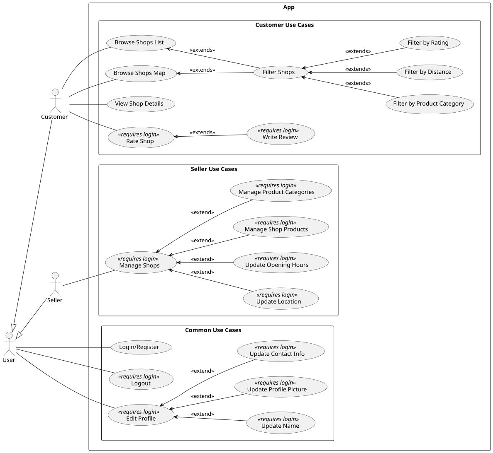
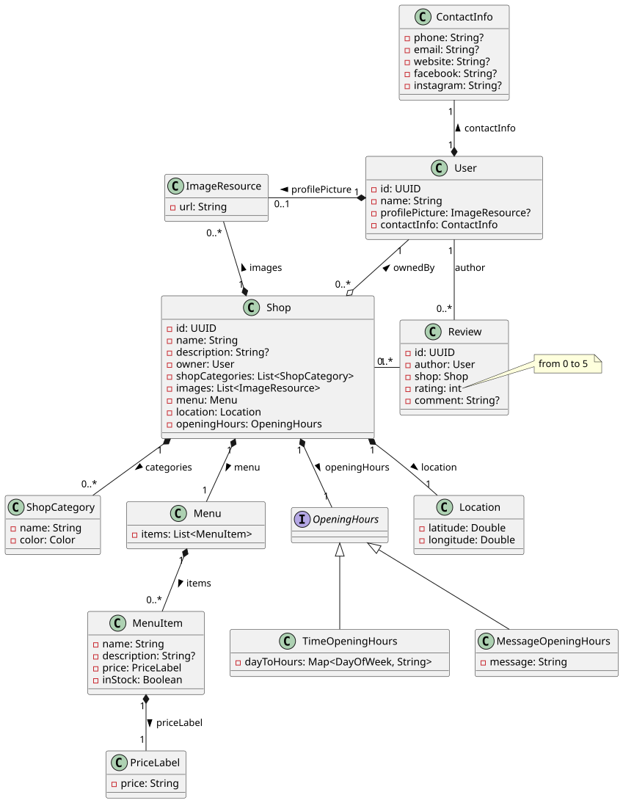

**Název práce:**

- "Vývoj aplikace pro propagaci prodeje domácích surovin pomocí Kotlin Multiplatform"

**Technologie:**

- Kotlin
- Jetpack Compose
- Firebase
- Mapbox

**Zaměření práce:**

- návrh mobilní aplikace
- návrh uživatelského rozhraní
- architektura softwaru
- Backend-as-a-Service (BaaS)
- Android vývoj (Jetpack Compose, Firebase)
- geolokační a mapové služby

**Motivace:**

- možná využití: med/včelařství, zelenina, maso, vinařství, domácí produkty
- drobní producenti často nemají jednoduchý způsob, jak oslovit zákazníky ve svém okolí
- prodej bývá realizován například pouze pomocí osobního doporučení, cedulí, osobního doporučení
  nebo centrálním výkupem
- cílem aplikace je usnadnit prezentaci nabídky a dohledání lokálních producentů

**Funkční požadavky**

- Uživatel může zobrazit obchody v mapovém nebo seznamovém zobrazení.
- Uživatel může filtrovat zobrazené obchody podle kategorie, vzdálenosti a průměrného hodnocení.
- Uživatel může zobrazit detail obchodu, včetně popisu, fotografií, nabídky produktů a kontaktních
  údajů.
- Uživatel může vytvořit uživatelský účet.
- Registrovaný uživatel může vytvářet nové obchody.
- Registrovaný uživatel může upravovat a spravovat obchody, které vytvořil.
- Registrovaný uživatel může upravovat své kontaktní údaje zobrazované u jeho obchodů.
- Registrovaný uživatel může ke svým obchodům přidávat název, popis, kategorie, fotografie, nabídku
  produktů a otevírací dobu.
- Registrovaný uživatel může vytvářet recenze obchodů ostatních uživatelů.

**Nefunkční požadavky:**

- Aplikace je určena pro platformu Android.
- Uživatelské rozhraní aplikace musí být přehledné a snadno použitelné i pro méně technicky zdatné
  uživatele.
- Aplikace musí umožňovat plynulé zobrazení mapy a obchodů bez výrazných prodlev.
- Data uložená v aplikaci musí být přístupná pouze oprávněným uživatelům.
- Aplikace musí být navržena tak, aby bylo možné ji dále rozšiřovat o další funkce.

**Use Case Diagram:**

**Class Diagram:**

**Postup vývoje**

- analýza existujících řešení
- návrh funkčních a nefunkčních požadavků
- návrh use case diagramu
- návrh class diagramu
- návrh architektury aplikace
    - MVVM
    - UseCaseResult wrapper
        - Success + data
        - Failure + error messages
        - funkcionální přístup
    - oddělení doménové a datové vrstvy
    - dependency injection
    - modulární struktura projektu
- implementace aplikace
    - Firebase integrace
    - práce s mapovými službami
    - geolokační vyhledávání
    - správa stavu uživatelského rozhraní
- testování a nasazení aplikace
