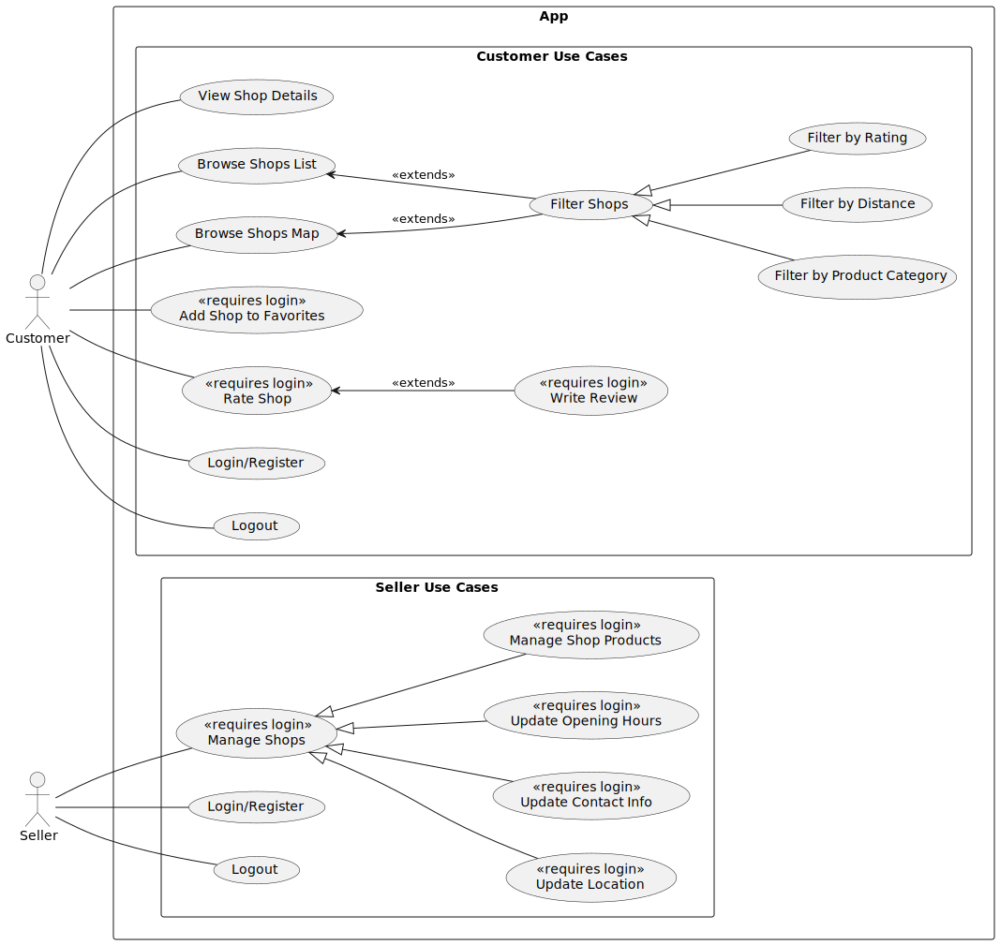

**Název pro práci:**

- "Vývoj aplikace pro propagaci prodeje domácích surovin pomocí Kotlin Multiplatform"

**Tech:**

- KMP (Kotlin multiplatform), Jetpack Compose, SwiftUI
- Firebase

**Zaměření práce**:

- návrh aplikace
- UX design
- architektura softwaru
- cloud-based architecture, BaaS (Backend as a Service)
- android vývoj (Jetpack Compose, Firebase)

**Motivace**:

- Možná využití: med/včelařství, brambory, zelenina, maso, vinařství
- V ohledu včelařství: aktuálně pouze svoz na centrální místo, výkup za relativně nízké ceny a
  přeprodej do obchodů
- Prodej zeleniny apod na vesnicích: často jen cedule s nápisem

**Funkční požadavky**

- Uživatel může zobrazit obchody v~mapovém nebo seznamovém zobrazení.
- Uživatel může filtrovat zobrazené obchody podle kategorie, vzdálenosti a průměrného hodnocení.
- Uživatel může zobrazit detail obchodu, včetně popisu, fotografií a kontaktních údajů.
- Uživatel může vytvořit uživatelský účet.
- Registrovaný uživatel může vytvářet nové obchody.
- Registrovaný uživatel může upravovat a spravovat obchody, které vytvořil.
- Registrovaný uživatel může upravovat své kontaktní údaje zobrazované u~jeho obchodů.
- Registrovaný uživatel může ke svým obchodům přidávat název, popis, kategorie nabízených produktů,
  fotografie, nabídku produktů a otevírací dobu.
- Registrovaný uživatel může vytvářet recenze obchodů ostatních uživatelů.

**Nefunkční požadavky**:

- Aplikace je určena pro platformu Android.
- Uživatelské rozhraní aplikace musí být přehledné a snadno použitelné i~pro méně technicky zdatné
  uživatele.
- Aplikace musí umožňovat plynulé zobrazení mapy a obchodů bez výrazných prodlev.
- Data uložená v~aplikaci musí být přístupná pouze oprávněným uživatelům.
- Aplikace musí být navržena tak, aby bylo možné ji dále rozšiřovat o~další funkce.

**Use Case Diagram**:

**Class Diagram**:

**Postup vývoje**

- demo aplikace
- UC diagram
- Class diagram
- návrh architektury kódu
    - generic firebase repository -> konkrétní repository (dědí z generic FB repository)
    - UC classes namísto service class
    - UseCaseResult wrapper
        - Success + data
        - Failure + error messages
        - funkcionální přístup
    - rozdělení kódu
        - modulárně, packages, features, core, common, ui
- implementace generického repository a napojení na firebase
